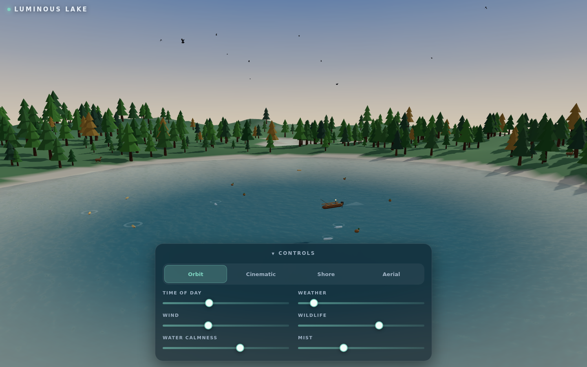
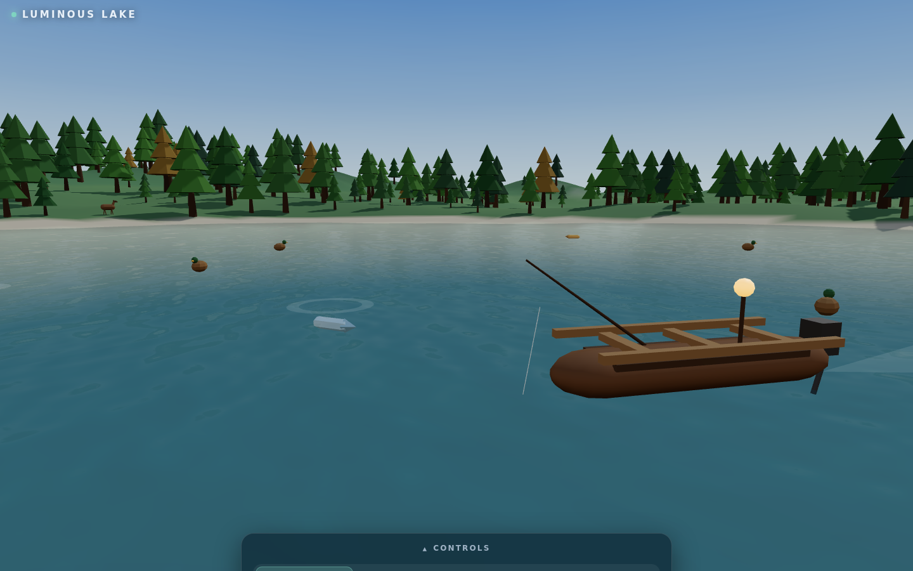
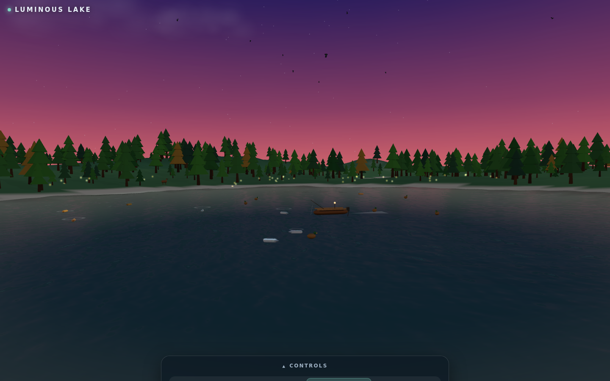
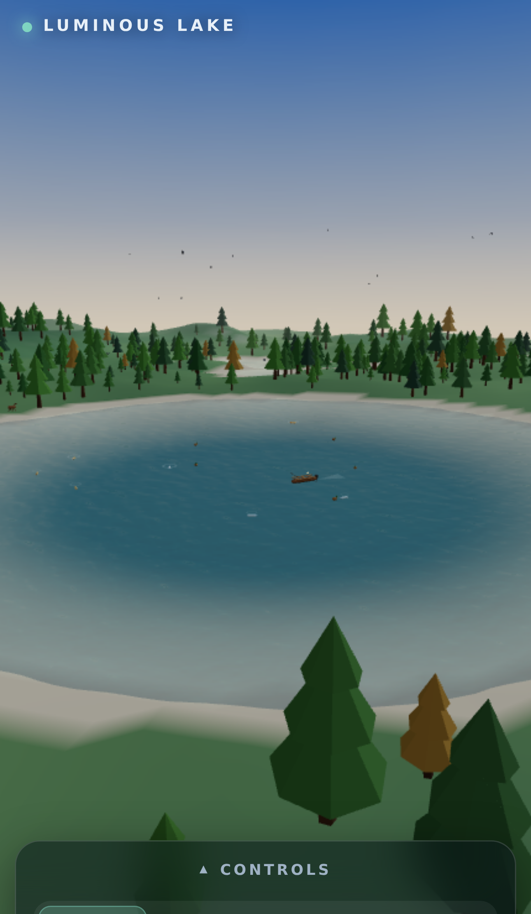

# 빛나는 호수 (Luminous Lake)

브라우저에서 바로 돌아가는, 시네마틱 풍의 **완전 절차적 3D 호수 세계**입니다.
투명한 물결 사이로 헤엄치는 물고기, 바람에 흔들리는 잔물결, 호수 위를 떠도는 작은 어선,
살아 있는 숲, 변하는 날씨, 그리고 하루의 시간대까지 — 모든 게 코드로 생성됩니다.
**빌드 산출물 텍스처 없음, 모델 파일 없음**: 나무, 사슴, 오리, 잔물결까지 전부 런타임에서 생성합니다.

> 라이브 데모: https://sigco3111.github.io/luminous-lake/

---

## ✨ 무엇이 보이는가

| 낮의 호수 | 물고기가 보이는 투명한 수면 | 황혼의 해안 |
| :---: | :---: | :---: |
|  |  |  |

| 모바일 |  |
| :---: | :---: |
|  |  |

---

## 🌟 핵심 특징

### 💧 살아 있는 투명한 물
- `MeshPhysicalMaterial` + `clearcoat` + 굴절률(IOR 1.333)
- CPU 버텍스 파동(물의 메쉬, 배, 오리, 물고기 잔물결이 **같은 파동장**으로 동기화
- 듀얼 스크롤 캔버스 노멀맵 + `CubeCamera` 실시간 반사
- 잔잔하면 유리처럼 호수 바닥과 물고기가 보임 → 바람이 불면 우유처럼 뿌옇게

### 🚣 작은 어선
- 나무 선체, 벤치, 외장 모터, 낚싯대, 황혼의 등불, 부드러운 거품 자국
- 호수 위를 떠돌며 **물의 파도와 같은 진동으로** 위아래로 흔들림

### 🦌 살아 있는 생태계
- 사슴, 여우, 새, 오리, 은빛 물고기와 금빛 잉어
- 잉어는 잔물결 고리와 함께 호수 표면 바로 아래를 헤엄치며 가끔 물 밖으로 도약 + 물보라
- 해질녘엔 반딧불이

### 🌦️ 날씨와 시간
- 폭풍 시스템(비 + 번개) ↔ 맑은 날씨
- 새벽의 안개 띠, 황금빛 시간대, 별이 빛나는 밤, 달빛 반사
- 24시간 풀 루프

### 🎥 네 가지 카메라 감독 모드
- **궤도 (Orbit)** — 드래그하여 자유롭게 둘러보기
- **시네마틱 (Cinematic)** — 자동 스크립트 무빙
- **해안 (Shore)** — 호숫가 시점
- **공중 (Aerial)** — 위에서 내려다보기
- 시간대, 날씨, 바람, 야생 생물 밀도, 수면 잔잔함, 안개 슬라이더 포함

### ⚡ 적응형 품질
- FPS 미터 → 품질 스케일러가 반사 갱신 주기, 그림자, 픽셀 비율, 파티클 수를 자동 튜닝
- 미드레인지 폰에서도 매끄럽게

---

## 🚀 빠른 시작

```bash
npm install
npm run dev        # 로컬 개발 서버 (포트 4181)
npm run check      # 단위 테스트 + 린트 + 프로덕션 빌드
npm run test:e2e   # Playwright 엔드투엔드 (데스크탑 + 모바일)
```

빌드 산출물은 `dist/`에 떨어집니다 — 어떤 정적 파일 서버든 `dist/`를 서빙하면 끝.

---

## 🧠 동작 원리

| 요소 | 접근 |
| --- | --- |
| 파동 | 하나의 사인합 파동장이 물 메쉬, 배, 오리, 물고기 잔물결을 모두 동기화 |
| 물 셰이딩 | `MeshPhysicalMaterial` + 절차적 캔버스 노멀맵 + `CubeCamera` 반사 (지원 안 되면 자동 OFF) |
| 지형 | 시드형 값 노이즈 높이맵 + 호수 분화구 + 경사 인지(vertex color) + 깊이 그라데이션 호수 바닥 + caustic 점박이 |
| 하늘 | 절차적 그라데이션 돔 + equirect 환경맵 + 움직이는 태양/달 |
| 동물 | 순수 시뮬레이션 모듈(결정론적 RNG) → 저폴리 절차적 메쉬 |
| 성능 | 단계형 품질 스케일러 + FPS 미터 / WebGPU 우선, WebGL 자동 폴백 |

---

## ⌨️ 조작

| 입력 | 동작 |
| --- | --- |
| **1 / 2 / 3 / 4** 키 | 카메라 모드 전환 (궤도/시네마틱/해안/공중) |
| **드래그** (궤도 모드) | 카메라 회전 |
| **휠** | 줌 인/아웃 |
| **컨트롤 패널 슬라이더** | 시간대 · 날씨 · 바람 · 야생 생물 · 수면 잔잔함 · 안개 |
| **컨트롤 패널 ▾ 버튼** | 패널 접기/펼치기 (모바일은 기본 접힘) |

---

## 📐 기술 노트

- **WebGPU 우선**, 실패하면 자동으로 클래식 WebGL 폴백 → 어디서든 실행됨
- 결정론적 사인합 파동 하나로 물·배·오리·물고기 모두 동기화 → 시각적 일관성 보장
- **모든 텍스처**(하늘, 환경, 노멀맵, 글로우, 구름, 안개)가 `<canvas>`에서 런타임 생성 → **이진 자산 0바이트**
- 첫 실행 시 WebGL을 차단하면 친절한 안내 화면 노출

---

## 🛠️ 사용한 라이브러리

- [Three.js](https://threejs.org) ^0.179.1 — WebGPU 우선, WebGL 폴백
- [Vite](https://vitejs.dev) ^7.1.3 — 빌드 + 개발 서버
- [ESLint](https://eslint.org) ^9.34.0 — 린트
- [@playwright/test](https://playwright.dev) ^1.61.1 — E2E 테스트
- `@eslint/js` ^9.34.0

---

## 📂 프로젝트 구조

```
luminous-lake/
├── index.html              # 진입점 + 정적 CSS (글래스모피즘 패널)
├── vite.config.js          # Vite 설정 (서브경로 /luminous-lake/)
├── src/
│   ├── main.js             # WebGPU/WebGL 부트, 루프 시작
│   ├── ui.js               # 컨트롤 패널 + 슬라이더 + 카메라 버튼
│   ├── sim/                # 시뮬레이션 코어 (RNG, 파동, 날씨, 시간, 동물)
│   └── world/              # 렌더링: 호수, 어선, 숲, 하늘, 동물 뷰 등
├── test/                   # node --test 단위 테스트 (34개) + Playwright E2E
├── public/                 # 정적 자산 (LICENSE 사본 등)
├── docs/screenshots/       # README용 스크린샷
└── dist/                   # 빌드 산출물 (Pages 배포 대상)
```

---

## 📜 라이선스

**MIT License** &middot; Copyright (c) 2026 Bles Software
원본 저장소: https://github.com/stas4000/luminous-lake
전체 라이선스 전문은 [LICENSE](./LICENSE) 참조.

본 저장소는 MIT 라이선스에 따라 **원본 소스를 그대로 안내 + 한글 UI로 재게시**한 한글화 포크입니다.
원작자 표기와 라이선스 고지를 보존하며, 코드 변경 없이 UI 텍스트만 한국어로 다국어화했습니다.
빌드와 실행 결과는 원본과 100% 동일하게 동작합니다.