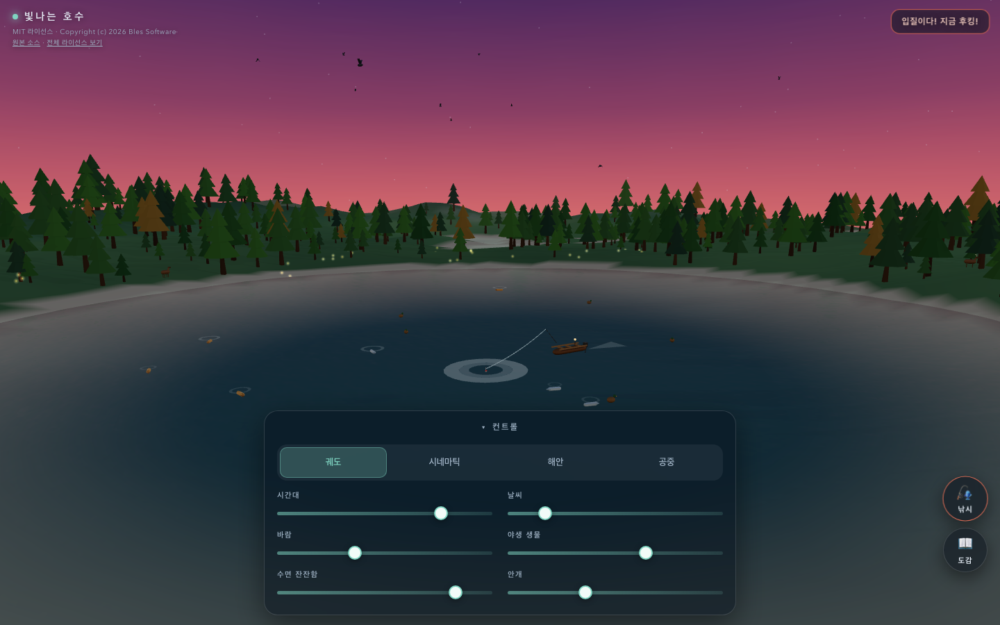
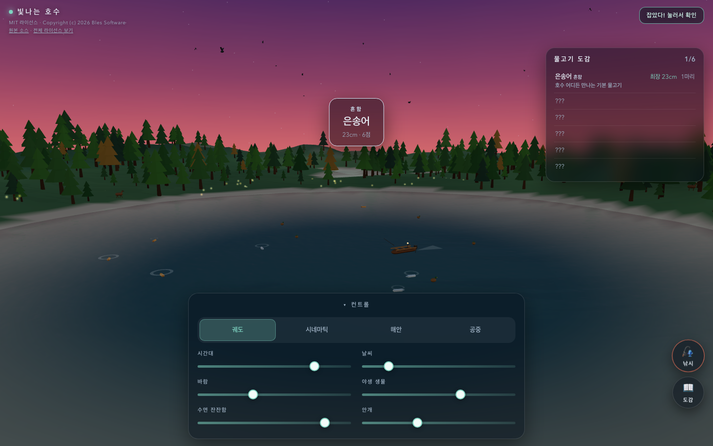
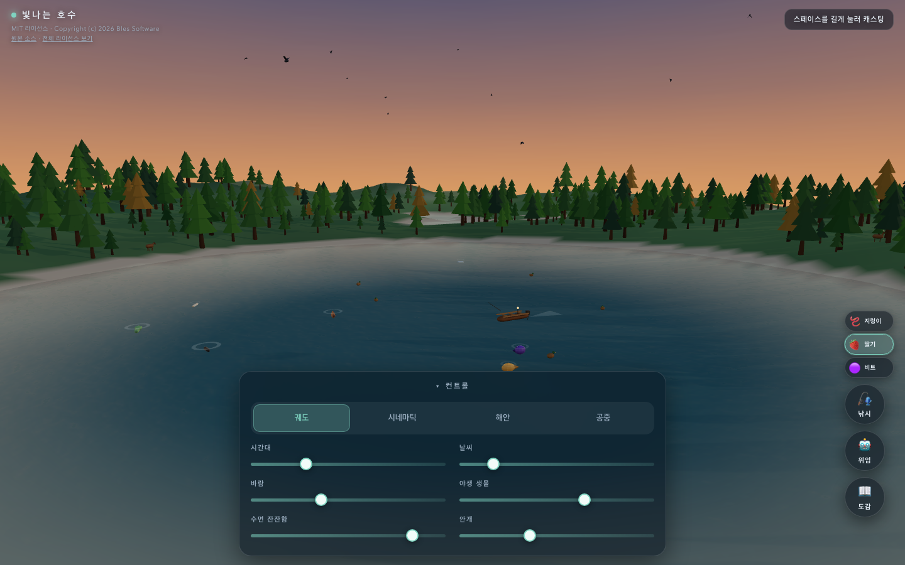
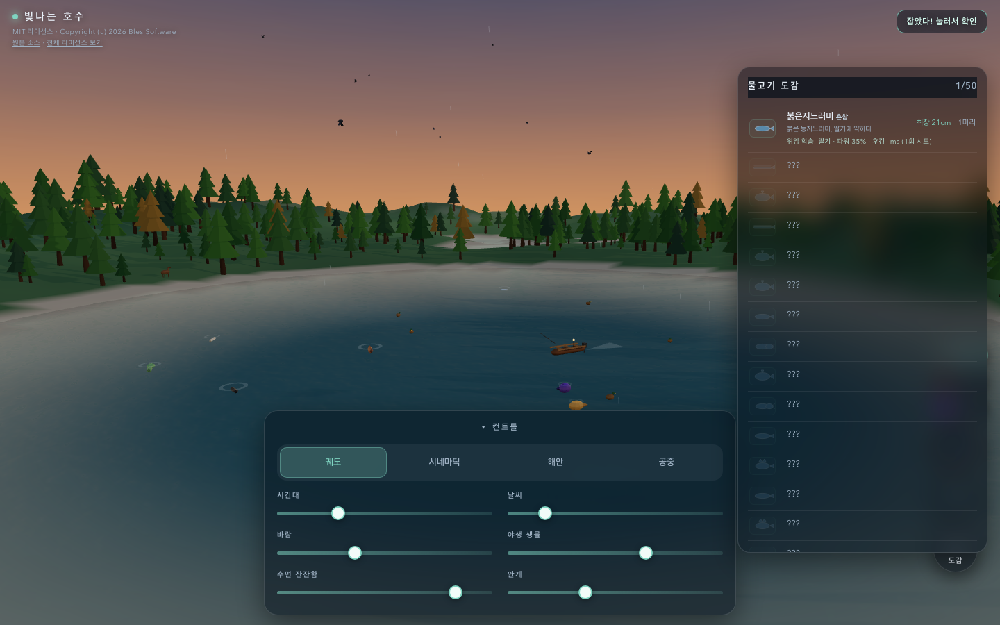

# 빛나는 호수 (Luminous Lake)

> **시네마틱 풍 3D 호수 + 50종 어종 도감 + 위임(자동) 낚시**
> 브라우저에서 즉시 실행. 텍스처·모델 0바이트 — 모든 게 절차적으로 생성됩니다.

라이브 데모: <https://sigco3111.github.io/luminous-lake/>

---

## 📸 미리보기

| 낮의 호수 | 물고기가 보이는 투명한 수면 | 황혼의 호수 |
| :---: | :---: | :---: |
|  |  |  |

| 모바일 (터치 최적화) | 낚시 — 입질 | 낚시 — 어획 |
| :---: | :---: | :---: |
|  |  |  |

| 미끼 칩 + 50종 회유어 | 50종 도감 |
| :---: | :---: |
|  |  |

---

## ✨ 무엇이 보이는가

`MeshPhysicalMaterial` 한 겹과 결정론적 사인합 파동 하나로 다음이 동시에 살아 움직입니다:

- **호수** — 굴절률 1.333의 투명한 물, CPU 버텍스 파동이 잔물결·배·오리·물고기를 모두 동기화, 듀얼 캔버스 노멀맵 + `CubeCamera` 실시간 반사. 잔잔하면 유리처럼 호수 바닥이 보이고, 바람이 불면 우유처럼 뿌옇게
- **숲** — 600여 그루의 절차적 저폴리 나무가 시드형 값 노이즈에 따라 배치, 바람 슬라이더로 흔들림, 안개·그림자·vertex color로 입체감 부여
- **동물** — 사슴, 여우, 새, 오리, 그리고 **6 meshType × 8 색상 팔레트**로 그려지는 물고기. 잉어는 잔물결 고리와 함께 호수 표면 아래를 헤엄치며 물 밖으로 도약
- **하늘** — 절차적 그라데이션 돔 + equirect 환경맵, 움직이는 태양과 달, 별과 반딧불이
- **날씨** — 맑음 ↔ 흐림 ↔ 비 ↔ 폭풍(번개). 슬라이더로 직접 조작하거나 자동 드리프트에 맡김

---

## 🎣 낚시 게임

작은 어선이 호수를 도는 사이, **스페이스 한 번으로 캐스팅 → 입질 → 후킹 → 릴링 → 어획**까지 풀 사이클이 진행됩니다. 모든 게임 규칙은 순수 모듈이라 단위 테스트로 전부 검증됩니다.

### 🐟 50종 어종 (meshType 6 × 색상 8)

| 메쉬 타입 | 형태 | 예시 어종 |
| --- | --- | --- |
| `trout` 송어형 | 캡슐 + 콘 꼬리 (스트림라인) | 은송어, 송사리, 송어, 연어, 흰살생이 |
| `carp` 잉어형 | 깊은 몸 + 분기형 꼬리 + 등 지느러미 | 금잉어, 거울잉어, 텐치, 떡붕어 |
| `catfish` 메기형 | 넓은 머리 + 2 수염 + 바렐형 몸 | 유럽대메기, 동자개, 레비아탄 |
| `perch` 우럭형 | 측면 압축 + 가시 등 지느러미 | 황혼우럭, 민물베스, 쏠배리, 시클리드 |
| `eel` 뱀장형 | 길고 가는 몸 + 뾰족한 머리 + 등 지느러미 | 유령은어, 칠성장어, 가아, 철갑상어 |
| `puffer` 복어형 | 둥근 공 + 작은 가시 + 측면 지느러미 | 복어, 야생복어 |

| 희귀도 | 점수 | 분포 |
| --- | --- | --- |
| 흔함 (common) | ×10 | 18종 |
| 보통 (uncommon) | ×25 | 16종 |
| 희귀 (rare) | ×60 | 10종 |
| 영웅 (epic) | ×150 | 1종 |
| 전설 (legendary) | ×400 | 5종 |

**시간대·날씨·잔잔함**이 어종 가중치에 직접 반영됩니다. 같은 호수도 새벽에는 금잉어, 한밤중에는 유령은어, 폭풍에는 레비아탄 — 모든 게 자연스럽게 등장합니다.

### 🪱🍓🟣 미끼 시스템

| 미끼 | 선호 어종 | 효과 |
| --- | --- | --- |
| 🪱 **지렁이** | 기본 — 대부분의 어종이 약하게 반응 | 중립 (×1.0) |
| 🍓 **딸기** | 초식성 어종 + 화려한 비늘 (금잉어, 잉어, 아로와나, 시클리드 등 13종) | 매칭 시 ×2.0, 미스 시 ×0.5 |
| 🟣 **비트** | 저서 어종 (붕어, 텐치, 거울잉어, 감붕어 등 5종) | 매칭 시 ×2.0, 미스 시 ×0.5 |

1/2/3 키 또는 우측 칩으로 즉시 전환. 도감에는 어종별 선호 미끼가 색깔로 표시됩니다.

### 🎮 풀 사이클 미니게임

```
충전 → 캐스팅 → 대기 → 입질(1.15s) → 후킹 → 릴링 → 어획/도주
                     ↑↓ 짧게 탭 = 회수           ↑↑ 장력 1.0 = 스냅
```

- **캐스팅** — 길게 누를수록 파워 ↑ (찌가 더 멀리 날아감)
- **입질** — 찌가 흔들리고 물보라가 커집니다. 1.15초 안에 후킹
- **릴링** — 누르면 줄을 감아 장력·진행 동시 증가, 떼면 늦춥니다. 어종별 강도·크기에 따라 *텐션 임계값*과 *진행 속도*가 분기
- **어획** — 진행 1.0 도달 시 토스트와 도감 자동 갱신
- **도주** — 장력 1.0 = 라인 스냅, 시간 초과 = 회수

### 🤖 위임 (자동) 모드

스페이스를 한 번도 안 눌러도 어획이 가능한 AI 어부입니다.

**작동 원리** (`src/sim/delegate.js`):
1. 매 프레임 환경(tod·날씨·잔잔함)과 현재 미끼로 어종 가중치 풀이에서 가장 무거운 종을 *타겟*으로 선정
2. 타겟 어종의 `profile.distance`(near/mid/far)에 맞춰 **캐스팅 파워** 결정
3. 어종별 선호도 기반으로 **미끼** 자동 전환(또는 기존 미끼 유지 모드)
4. 어종별 `profile.hookDelay`(0.25-0.55s)에 맞춰 **후킹 타이밍** 결정
5. 어종별 `profile.holdThreshold` 근처에서 **릴 장력** 자동 호흡

**위임 학습 로그**: 어종별로 *어떤 미끼·파워·후킹 타이밍으로 잡혔는지* 마지막 6회까지 누적 → 도감의 "위임 학습" 줄에 표시됩니다. 직접 낚시할 때 참고 가능.

> 한참 위임을 돌려두면 도감이 저절로 채워지고, 도감의 학습 노트가 캐스팅의 *공략*이 됩니다.

### 📖 도감

50행 + **6 meshType 실루엣 SVG 사진** + 색상 톤. 잡은 어종은 상단 정렬되며 다음이 누적됩니다:

- 종별 **최장 cm** (가장 큰 한 마리)
- 종별 **마리 수**
- 어종 **희귀도 배지** (색상 라벨)
- 어종 **노트** (시간대·날씨·서식지 단서)
- 위임이 잡았을 때의 **위임 학습 팁**: `딸기 · 파워 35% · 후킹 480ms (3회 시도)`

### ⌨️ 조작

| 입력 | 동작 |
| --- | --- |
| **1 / 2 / 3 / 4** | 카메라 모드 (궤도 / 시네마틱 / 해안 / 공중) |
| **드래그** (궤도) | 카메라 회전 |
| **휠** | 줌 인/아웃 |
| **스페이스 길게** | 캐스팅 파워 충전 → 손 떼면 던짐 |
| **스페이스 (입질 시)** | 후킹 |
| **스페이스 (릴링 중)** | 누르고 있는 동안 줄 감기 |
| **스페이스 (결과)** | 어획 확인 |
| **1 / 2 / 3** (낚시 모드) | 미끼 선택 (지렁이 / 딸기 / 비트) |
| **C** | 도감 열기/닫기 |
| **D** | 위임 모드 토글 |
| **Esc** | 도감 닫기 + 위임 끄기 |
| **하단 슬라이더** | 시간대 · 날씨 · 바람 · 야생 생물 · 수면 잔잔함 · 안개 |
| **하단 🎣 버튼** | 마우스/터치로 낚시 액션 (press/release) |
| **하단 🤖 버튼** | 위임 모드 (스페이스 없이 자동) |
| **하단 📖 버튼** | 도감 패널 |
| **하단 미끼 칩** | 클릭 즉시 미끼 전환 |

---

## 🎥 네 가지 카메라 감독 모드

| 모드 | 설명 |
| --- | --- |
| **궤도 (Orbit)** | 드래그로 자유 회전. 기본 모드 |
| **시네마틱 (Cinematic)** | 자동 스크립트 무빙. 마우스/터치 입력 시 궤도로 복귀 |
| **해안 (Shore)** | 호숫가에서 호수를 올려다보는 시점 |
| **공중 (Aerial)** | 위에서 내려다보는 탑뷰 |

---

## ⚡ 적응형 품질

FPS 미터가 프레임을 샘플링해 품질 스케일러가 다음을 자동 튜닝합니다 — 미드레인지 폰에서도 매끄럽게:

- `CubeCamera` 반사 갱신 주기 (4–12프레임)
- 노멀맵 갱신 빈도
- 그림자 on/off (모바일은 항상 off)
- 파티클 수 (비·반딧불이)
- 픽셀 비율 캡 (DPR 1.0–2.0)

---

## 🚀 빠른 시작

```bash
npm install
npm run dev          # 로컬 서버 (포트 4181)
npm run check        # 단위 테스트 + 린트 + 프로덕션 빌드
npm run test:e2e     # Playwright E2E (데스크탑 + 모바일)
npm run validate     # check + test:e2e (풀 파이프라인)
```

빌드 산출물은 `dist/`에 떨어집니다 — 어떤 정적 파일 서버든 `dist/`를 서빙하면 끝.

---

## 🧠 동작 원리

| 요소 | 접근 |
| --- | --- |
| **파동장** | 결정론적 사인합 1개로 물 메쉬·배·오리·물고기 잔물결을 모두 동기화 |
| **물 셰이딩** | `MeshPhysicalMaterial` + 절차적 캔버스 노멀맵 + `CubeCamera` 반사 (지원 안 되면 자동 OFF) |
| **지형** | 시드형 값 노이즈 높이맵 + 호수 분화구 + 경사 인지(vertex color) + 깊이 그라데이션 호수 바닥 + caustic 점박이 |
| **하늘** | 절차적 그라데이션 돔 + equirect 환경맵 + 움직이는 태양/달 |
| **동물 시뮬** | 순수 모듈(결정론적 RNG, delta-time) → 저폴리 절차적 메쉬 |
| **낚시 시뮬** | `src/sim/fishing.js` — 상태머신 (idle→charging→casting→waiting→bite→reeling→result) |
| **위임 에이전트** | `src/sim/delegate.js` — 어종 가중치 풀에서 타겟 선정 + 어종별 프로파일 적용 |
| **성능** | 단계형 품질 스케일러 + FPS 미터 / WebGPU 우선, WebGL 자동 폴백 |

---

## 📐 기술 노트

- **WebGPU 우선, 실패 시 WebGL 폴백** — `navigator.gpu`가 있으면 `three/webgpu`의 `WebGPURenderer`, 없거나 어댑터가 실패하면 클래식 `WebGLRenderer`
- **이진 자산 0바이트** — 모든 텍스처(하늘·환경·노멀맵·글로우·구름·안개)가 `<canvas>`에서 런타임 생성
- **첫 실행 친절 안내** — WebGL을 막아둔 환경에서는 한국어 안내 화면 노출
- **시뮬 / 뷰 분리** — 게임 로직은 순수 모듈 (RNG, 시간, 파동, 날씨, 동물, **낚시**, **위임**), 뷰는 plain data를 읽어 메쉬로 그림 → 게임 규칙 추가는 단위 테스트로 보장
- **결정론적 시뮬** — 모든 RNG가 시드 기반이라 리플레이·테스트·디버깅이 결정적
- **E2E 디버그 시임** — `window.__luminous.fishing` (sim 직접 접근), `fishingFastForward(frames, {drain})` (결정론적 시간 진행), `pauseFishing()/resumeFishing()` (rAF throttle 격리), `setDelegateMode()` 등
- **라이선스 보존** — 원본 `luminous-lake`(MIT) 라이선스를 그대로 안내하면서 한글 UI 추가

---

## 🛠️ 사용한 라이브러리

| 라이브러리 | 버전 | 역할 |
| --- | --- | --- |
| [Three.js](https://threejs.org) | ^0.179.1 | WebGPU 우선, WebGL 폴백 |
| [Vite](https://vitejs.dev) | ^7.1.3 | 빌드 + 개발 서버 |
| [ESLint](https://eslint.org) | ^9.34.0 | 린트 |
| [@eslint/js](https://eslint.org) | ^9.34.0 | 권장 규칙 |
| [@playwright/test](https://playwright.dev) | ^1.61.1 | E2E (Chromium 데스크탑 + 모바일) |

---

## 📂 프로젝트 구조

```
luminous-lake/
├── index.html              # 진입점 + 글래스모피즘 CSS
├── vite.config.js          # Vite 설정 (서브경로 /luminous-lake/)
├── eslint.config.js        # ESLint 설정 (src + test 글로벌)
├── playwright.config.js    # Playwright 프로젝트 + 모바일 디바이스
├── public/                 # 정적 자산 (LICENSE 사본)
├── docs/screenshots/       # README용 캡처
├── src/
│   ├── main.js             # WebGPU/WebGL 부트, 메인 루프, 디버그 핸들
│   ├── ui.js               # 컨트롤 패널 + 낚시 HUD + 미끼 칩 + 도감 + 위임 UI
│   ├── sim/                # 결정론적 순수 모듈
│   │   ├── controls.js     # clamp/damp/wrapTime 등 헬퍼
│   │   ├── rng.js          # mulberry32 + ValueNoise
│   │   ├── waves.js        # 사인합 파동장 (물·배·오리·물고기 공유)
│   │   ├── timecycle.js    # 24h 시간 사이클 + dawn/night/star/firefly 가시성
│   │   ├── weather.js      # clear↔cloudy↔rain↔storm 머신 + 번개 + 자동 드리프트
│   │   ├── animals.js      # 사슴/여우/새/오리/물고기/반딧불이 상태머신
│   │   ├── fishing.js      # 50종 + 캐스팅/입질/릴링 시뮬 + 미끼 + 도감 누적
│   │   └── delegate.js     # DelegateAgent + DelegateLog (자동 어부)
│   └── world/              # 렌더링 (plain data → 메쉬)
│       ├── terrain.js      # 시드형 높이맵 + 호수 분화구 + vertex color
│       ├── water.js        # MeshPhysicalMaterial + 노멀맵 + CubeCamera
│       ├── forest.js       # 600+ 절차적 나무
│       ├── sky.js          # 그라데이션 돔 + 환경맵 + 태양/달
│       ├── weatherView.js  # 비 파티클 + 안개
│       ├── animalsView.js  # 6 meshType × 8 palette 물고기 + 사슴/여우/새/오리
│       ├── boat.js         # 어선 (rodPivot + tipAnchor 노출)
│       ├── fishingView.js  # 찌 + 베지어 낚싯줄 + 굽힘 애니메이션
│       ├── cameras.js      # 4 카메라 모드 감독
│       └── textures.js     # 절차적 캔버스 텍스처
├── test/                   # 결정론적 단위 + Playwright E2E
│   ├── rng.test.js         # 시드 기반 RNG 일관성
│   ├── timecycle.test.js   # 24h wrap, dawn/night 일관성
│   ├── weather.test.js     # 4 상태 전환, 슬라이더 라운드트립
│   ├── boat.test.js        # 어선 위치·헤딩·웨이브 동기화
│   ├── quality.test.js     # 적응형 품질 스케일러
│   ├── animals.test.js     # 시뮬 상태머신 결정론
│   ├── fishing.test.js     # 50종 일관성 + 풀 사이클
│   ├── delegate.test.js    # DelegateAgent 결정론 + DelegateLog
│   └── app.e2e.js          # Playwright (18개 — 데스크탑+모바일)
└── dist/                   # 빌드 산출물 (gh-pages)
```

---

## 🧪 검증

| 단계 | 명령 | 결과 |
| --- | --- | --- |
| 단위 테스트 | `npm test` | **59/59** 통과 (RNG·시간·날씨·배·품질·동물·낚시·위임) |
| 린트 | `npm run lint` | 통과 (no-unused-vars·no-undef·no-unused 등) |
| 프로덕션 빌드 | `npm run build` | 통과 (~810KB gzip 214KB, three 분리) |
| E2E | `npm run test:e2e` | **18/18** 통과 (데스크탑 9 + 모바일 9) |
| 풀 파이프라인 | `npm run validate` | check + test:e2e |

E2E가 모바일 디바이스 에뮬레이션까지 통과하는 게 중요한데, 이건 *글래스모피즘 패널이 좁은 뷰포트에서도 깨지지 않는다* + *포인터 이벤트가 합성으로 들어와도 핸들러가 죽지 않는다* + *낚시 풀 사이클이 모바일 흐름에서도 끝까지 닫힌다*는 보장입니다.

---

## 📜 라이선스

**MIT License** · Copyright (c) 2026 Bles Software
원본 저장소: <https://github.com/stas4000/luminous-lake>
전체 라이선스 전문은 [LICENSE](./LICENSE) 참조.

본 저장소는 MIT 라이선스에 따라 원본 소스를 그대로 안내하면서 **한글 UI로 재게시**한 한글화 포크이며, 어종 50종·미끼 시스템·위임 모드·도감 사진을 추가한 포크입니다. 원작자 표기와 라이선스 고지를 보존합니다.
